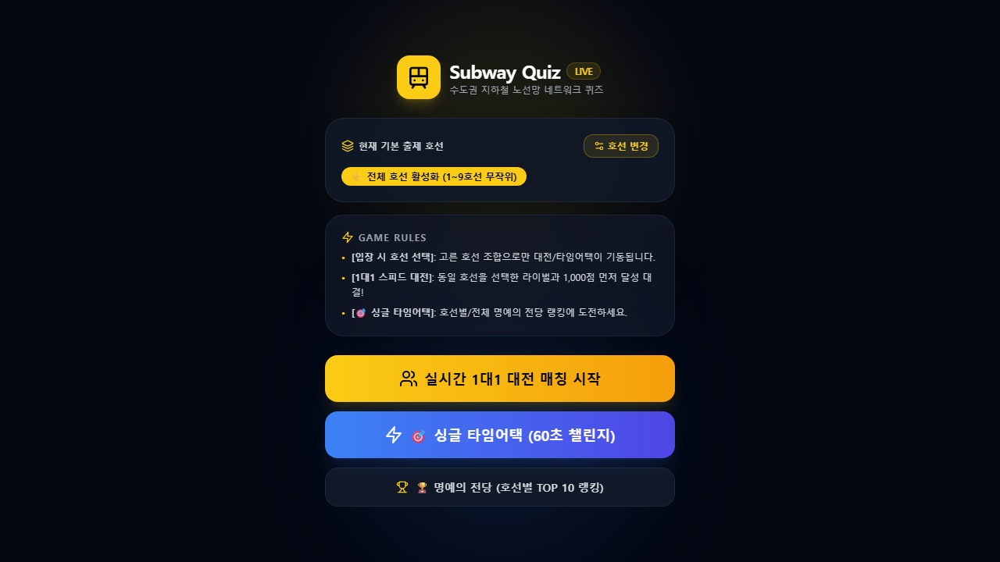
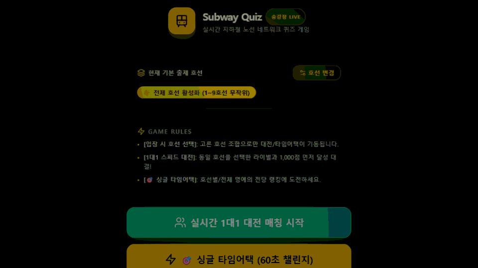
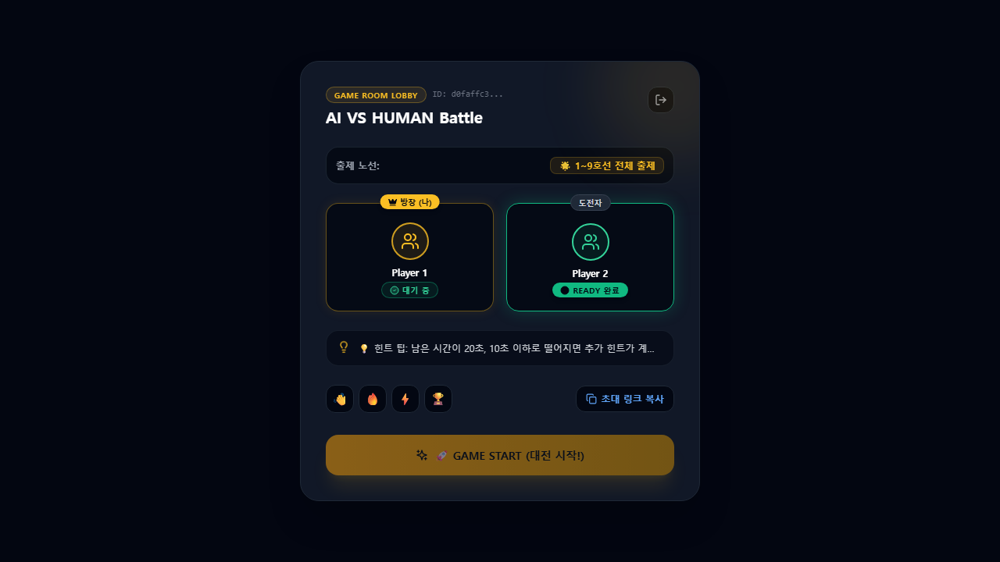
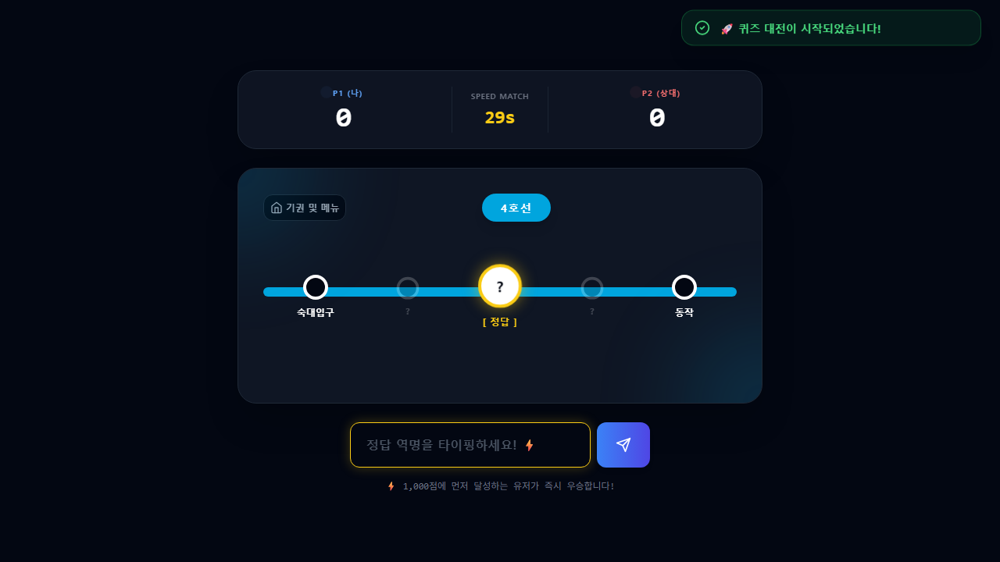
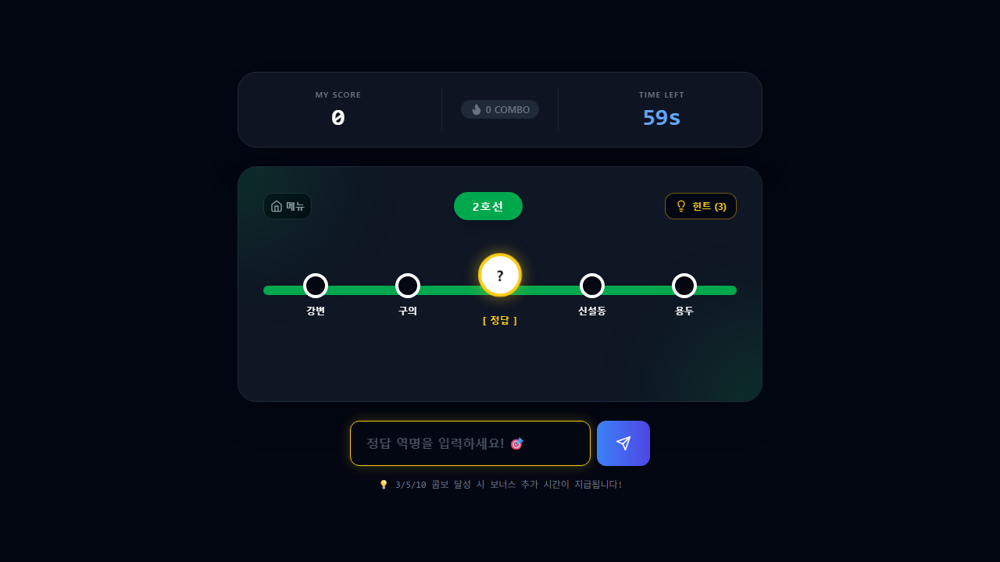

# 🚇 Subway Quiz (실시간 지하철 퀴즈 대전 플랫폼)

[](https://subway-quiz.vercel.app/)

실시간 지하철 노선 네트워크 구조를 활용하여 1대1로 마주 보며 선착순으로 정답을 외쳐 점수를 획득하는 **양방향 실시간 스피드 경쟁 퀴즈 게임**입니다. 



---

## 🎥 Gameplay Video Demos (실제 게임 플레이 시연 GIF)

| ⚔️ 1대1 실시간 멀티플레이어 대전 시연 데모 | 🎯 싱글 타임어택 챌린지 시연 데모 |
| :---: | :---: |
|  |  |

---

## 📸 In-Game Screenshots (실제 게임 화면)

### 1v1 실시간 멀티플레이 대기실 및 대전 화면
| 🟢 대기실 (초직관적인 READY 상태 분기) | ⚔️ 실시간 멀티플레이 대전 화면 |
| :---: | :---: |
|  |  |

### 🎯 싱글플레이 타임어택 (60초 챌린지) 화면
| 🎯 싱글플레이 타임어택 인게임 |
| :---: |
|  |

---

## ⚡ 핵심 게임 시스템
1. **실시간 1대1 매치메이킹**: Supabase 데이터베이스 트랜잭션과 RPC 함수를 통해 대기 중인 플레이어를 실시간으로 즉각 매칭합니다.
2. **선착순 스피드 경쟁**: 기존의 루즈한 턴 방식을 과감히 폐기하고, 동시에 동일한 문제를 보며 먼저 정답을 타이핑한 유저가 즉시 득점하고 다음 문제로 동시 전환됩니다.
3. **🎯 싱글 타임어택 (60초 챌린지) 모드**:
    * 혼자서도 지하철 퀴즈를 즐길 수 있는 60초 타임어택 모드를 신설하였습니다.
    * 오답 시 시간 차감 페널티를 제거하여 유저 스트레스를 최소화하였으며, **3/5/10 연속 콤보(Combo) 성공 시 보너스 추가 시간(+2초/+3초/+5초)** 및 추가 콤보 점수가 지급됩니다.
4. **💡 힌트 찬스 버튼 시스템**: 싱글모드 플레이 중 판당 총 3회의 힌트 찬스가 제공되며, 힌트 버튼 클릭 시 정답역의 초성(예: `이○`, `합○○`)이 즉시 오픈되어 막힘없이 게임을 계속 이어 나갈 수 있습니다.
5. **🏆 명예의 전당 (TOP 10 전역 랭킹 시스템)**: 싱글모드가 끝나면 닉네임을 입력해 Supabase `rankings` DB에 저장하고, 실시간 TOP 10 리더보드(금/은/동 메달 배지 및 점수)를 조회할 수 있습니다.
6. **🛡️ 세션 결함 복구 (Fail-safe) 에러 핸들링**: 매치메이킹, 방 조회, RPC 오류 또는 네트워크 소켓 장애 발생 시 유저가 정체 방에 방치되지 않도록 방 세션을 깨끗이 청소하고 메인 홈으로 안전하게 자동 탈출시킵니다.
7. **🎴 타격감 넘치는 퀴즈 전환 UI 연출**: 정답 시 **⭕ CORRECT!** 그린 네온 팝업 오버레이, Floating 득점 상승 텍스트(`+100pts`), 문제 카드 팝인 트랜지션 및 노선 네온 펄스 연출이 주입되어 몰입감을 극대화합니다.
8. **물리적 정렬 보장 힌트**: 상/하행 전진 추적(Forward Tracking) 알고리즘을 SQL 프로시저 내에 심어, 인접역 힌트가 실제 서울 지하철 노선도와 일치하여 꼬임 없이 순서대로 노출됩니다.
9. **Presence 기반 동적 세션 정리**:
    * 대기 중 방장이 탭을 닫으면 찌꺼기 룸 레코드가 DB에서 자동으로 청소(`DELETE`)됩니다.
    * 플레이 중 상대가 접속을 이탈하면 즉시 경고 팝업과 함께 대전을 종료(`FINISHED`)하고 메인 홈으로 돌려보냅니다.
10. **🧹 실시간 유령방 자가치유 (Self-Healing) 시스템**:
    * 유저가 비정상적으로 탭을 닫거나 인터넷 연결을 유실할 경우, 10초 주기 백그라운드 핑이 누락되어 30초 내로 유령방이 로비 갱신 로직을 통해 자동 감지되고 `'CANCELLED'` 파기 처리됩니다.
11. **🧪 E2E & Unit 테스트 자동화 파이프라인**:
    * Vitest(유닛 테스트)와 Playwright(다중 브라우저 컨텍스트 E2E 시나리오 테스트)의 자동 테스트 러너를 구축하고, 커밋 시 자동 체크하는 Git Pre-commit Hook 및 GitHub Actions CI 워크플로우를 도입했습니다.

---

## 🛠 기술 스택
* **Frontend**: React (TypeScript), Vite, Tailwind CSS, Lucide React, Canvas Confetti
* **Backend & DB**: Supabase (PostgreSQL, Realtime, Presence, RPC Functions)
* **Testing & Automation**: Playwright (E2E Test), Vitest (Unit Test), GitHub Actions (CI), Git Hooks (.githooks)
* **Data Sync**: Node.js, Axios, tsx (서울교통공사 OpenAPI 연동)

---

## 📐 노선망 분기 및 순환 엣지 정렬 알고리즘
1~9호선 확장 시 발생하는 복잡한 지선 분기선(예: 1호선 구로 분기, 5호선 강동 분기)과 순환선/루프선(예: 2호선 순환, 6호선 응암 루프)의 꼬임 없는 힌트 배치를 위해 아래 알고리즘이 적용되어 있습니다:
* **정밀 자연어 정렬 (`parseFrCode`)**: 외부 역코드(`FR_CODE`)를 접두어, 숫자부, 대시 뒤 세부 순서로 나누어 오름차순 나열을 보장합니다 (예: `100` ➡️ `100-1` ➡️ `100-2` ➡️ `101`).
* **지선 분기점 연결 보정**:
    * **1호선**: 구로(메인) ➡️ 가산디지털단지(경부지선)
    * **2호선**: 충정로 ➡️ 시청 (순환선 완성), 성수 ➡️ 용답 (성수지선), 신도림 ➡️ 도림천 (신도림지선)
    * **5호선**: 강동(메인) ➡️ 둔촌동 (마천지선 분기)
    * **6호선**: 구산 ➡️ 응암 (응암 순환 루프 완성)

---

## 🚀 빠른 시작 가이드 (Getting Started)

### 1단계: Supabase 데이터베이스 셋업
1. [supabase/schema.sql](./supabase/schema.sql)의 전체 쿼리를 복사하여 Supabase **SQL Editor**에서 실행합니다.
2. 실행 성공 후, 대시보드의 RLS 보안 제약 우회를 위해 아래 RLS 해제 쿼리를 추가 실행합니다:
    ```sql
    ALTER TABLE game_rooms DISABLE ROW LEVEL SECURITY;
    ALTER TABLE stations DISABLE ROW LEVEL SECURITY;
    ALTER TABLE lines DISABLE ROW LEVEL SECURITY;
    ALTER TABLE station_connections DISABLE ROW LEVEL SECURITY;
    ```

### 2단계: 데이터 동기화 및 1~9호선 전 노선망 주입
1. `data-sync/.env.example`을 참고하여 복사한 `data-sync/.env` 파일을 만들고 본인의 Supabase 및 서울 열린데이터광장 API Key를 입력합니다.
2. 데이터 동기화 모듈 실행:
    ```bash
    cd data-sync
    npm install
    npm run sync
    ```
    *(마스터 역 799개 적재 및 1~9호선 통합 연결망 엣지 902개가 적재됩니다.)*

### 3단계: 프론트엔드 구동
1. `frontend/.env.example`을 참고하여 `frontend/.env.local` 파일을 생성한 뒤 Supabase Anon Key와 URL을 입력합니다.
2. 프론트엔드 개발 서버 기동:
    ```bash
    cd frontend
    npm install
    npm run dev
    ```

---

## 📝 최근 업데이트 및 변경 사항 (자동 업데이트)
<!-- RELEASE_LOGS_START -->
- fix: AnswerForm onChange is not a function 런타임 에러 Universal Fallback 원천 수술 (#30) (2026-07-24)
- feat: feature/45-mobile-typing-and-live-mirroring 개발 브랜치 병합 요청 (#28) (2026-07-24)
- feat: 한글 자음/모음 초극세사 실시간 미러링, 노선 7대 테마 동기화, 모바일 자판 수술 & README GIF 반영 (#27) (2026-07-24)
- fix: 모바일 정답란 타이핑 버그 원천 해결 및 전 기기 스크롤 Zero 한눈 피팅 UI 적용 (#26) (2026-07-24)
- feat: 지하철 전광판 카드 UI 전면 리팩토링  (#25) (2026-07-24)
- feat: 큼직한 전광판 프레임 테두리, Pure CSS 지하철 객차 주행 및 README 시연 미디어 최종 갱신 (2026-07-24)
- feat: 서울교통공사 차내 LCD 전광판 및 승강장 테마 사이트 전체 비주얼 전면 리팩토링 (2026-07-24)
- feat: 아이폰 & 갤럭시 모바일 디바이스 UI/UX 최적화 (100dvh 키보드 대응, 역명 2줄 풀텍스트 노출, iOS Auto Zoom 방지) (#23) (2026-07-24)
- fix: Vercel 빌드 이중 경로 이동 오류 수정 (vercel.json 빌드 명령어 표준화) (2026-07-24)
- feat: Vercel 실운영 배포(vercel.json), 카카오톡 OG 메타태그 및 README 라이브 배지 반영 (2026-07-24)
- feat: 1대1 멀티플레이어 게임성 및 UX 종합 개선 (점수판 버그 수정, 목표점수 설정, 2단계 스피드 빌드업) (#22) (2026-07-24)
- feat: Playwright 2인 멀티플레이어 & 싱글 듀얼 게임 플레이 시연 영상 녹화 및 README 반영 (#19) (2026-07-23)
<!-- RELEASE_LOGS_END -->
